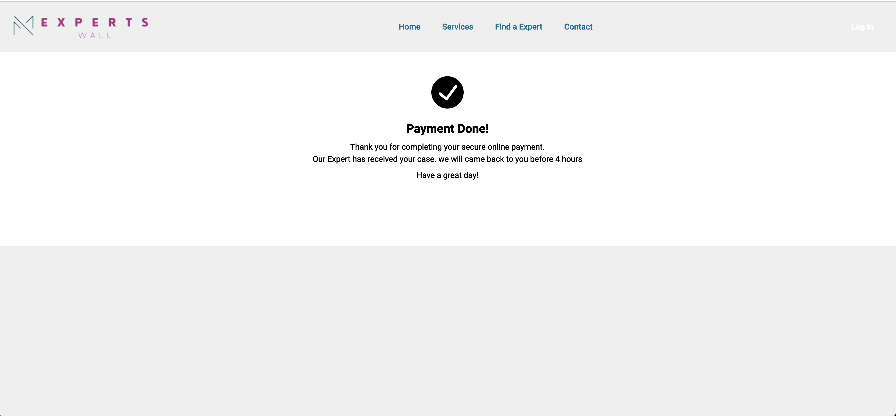

# IU-PORTFOLIO

# ExpertWall - Engineering Experts Connection Platform.

## Overview

ExpertWall is a dynamic platform connecting skilled engineers and users seeking expertise. Expert Wall stands as a sophisticated application meticulously crafted to foster collaboration between software developers and industry experts. Positioned as a platform where developers can actively seek guidance and assistance in the intricate task of debugging code, the application boasts a technologically advanced foundation. Leveraging cutting-edge technologies such as the MERN stack (MongoDB, Express.js, React, Node.js), Tailwind CSS, JWT (JSON Web Token), Vite, and Jest, Expert Wall is committed to delivering a robust and seamlessly integrated user experience.

The platform prioritizes visual enhancements and a polished user interface by harnessing the capabilities of Cloudinary to securely host images. Users engaging with the platform's assistance services initiate secure transactions via Stripe, ensuring a reliable and protected payment process. Admins play a pivotal role in upholding the caliber of expertise available, meticulously reviewing and approving experts based on stringent qualification standards.

Experts, in turn, enjoy a high degree of personalization for their profiles. This includes the ability to showcase availability schedules, set hourly rates, provide detailed experience information, and highlight the educational institutions they attended. Both users and experts have the autonomy to delete their accounts if they deem it necessary. The user registration process is designed for flexibility, accommodating both individual and company profiles based on distinct needs.

The platform further empowers users and experts by enabling them to seamlessly edit or delete their profiles, ensuring that presented information remains accurate and current. Users actively contribute to the platform's credibility by adding reviews to expert profiles, a privilege granted only after engaging with the expert's services and being activated as a purchaser.

To elevate user engagement, the platform strategically incorporates toast notifications, offering users timely and explicit updates. This feature significantly enhances the overall user experience, ensuring users stay informed about pertinent activities and updates within the platform. In essence, Expert Wall is dedicated to providing a comprehensive, efficient, and sophisticated environment for knowledge exchange and collaborative problem-solving within the developer community.

This comprehensive README provides an in-depth understanding of the project's architecture, technologies used, and key feature. This application is responsive and mobile first approach, means you can run the application on the phone, iPad, tablet, and desktop without interuption.

## Video Link on how Expert wall application works and how to install it locally :

https://vimeo.com/895566399/23a1c22e20?share=copy

## Table of Contents

1. [Introduction](#introduction)
2. [Technologies](#technologies)
   - [Frontend](#frontend)
   - [Backend](#backend)
3. [Key Features](#key-features)
   - [User Registration](#user-registration)
   - [Expert Registration](#expert-registration)
4. [Integration of Technologies](#integration-of-technologies)
   - [Stripe Payments](#stripe-payments)
   - [React Stack](#react-stack)
   - [Other Technologies](#other-technologies)
   - [Expert Availability](#expert-availability)
   - [User Review](#user-review)
5. [Documentation and Testing](#documentation-and-testing)
6. [Project Structure](#project-structure)
7. [How to Use](#how-to-use)
8. [Contributing](#contributing)
9. [Acknowledgements](#acknowledgements)

---

## Introduction

ExpertWall is a platform where engineering experts and users connect seamlessly. The application is designed to facilitate a smooth exchange of knowledge and assistance.

## Core Idea:

Expert Wall application is an innovative web application designed as a platform for junior software developers to connect with senior software developers effortlessly. Access to expert profiles is facilitated by reading expert profiles and choosing which domain of expertise you are looking for, this application ensures the authenticity and quality of interactions.

## Target Users: Junior software developer

- Who Are The Users?: The user audience includes students, professionals, hobbyists, and anyone seeking specialized knowledge and solutions in their software development daily debugging.
- Minimal Requirements: To use Expert Wall, users need:

- A device (phone, laptop, or tablet)
- Internet connectivity
- A valid email for registration
- A secure password

## Overall Architecture

### Key Components:

- #### User:
  Represents end-users seeking expert advice.
- #### Admin:
  Manages user and expert accounts.
- #### Login:
  Allows users and admins to access their accounts.
- #### Register:
  Permits new users to create platform accounts.
- #### Expert:
  Represents experts across various domains in technology.

## Methodologies

### 1. Agile Methodology:

Agile, chosen for its flexibility and user-centric focus, supports incremental development, aligning with user needs and expectations.

## MOBILE FIRST APPROACH


## LAPTOP


## IPAD


## PHONE


## Conceptual Design for Expert Wall Application

## CLOUD ARCHITECTURE


## EXPERT WALL ENTITY RELATIONSHIP


## Technologies

### Frontend

- [React](https://reactjs.org/) - A JavaScript library for building user interfaces.
- [React Spinner](https://www.npmjs.com/package/react-spinners) - Loading spinners for React.
- [React Router DOM](https://reactrouter.com/web/guides/quick-start) - Declarative routing for React.js.
- [React Icon](https://react-icons.github.io/react-icons/) - A set of customizable SVG icons for React.
- [Framer Motion](https://www.framer.com/motion/) - A production-ready motion library for React.
- [JSON Web Token](https://jwt.io/) - A compact URL-safe means of representing claims to be transferred between two parties.

### Backend

- [MongoDB](https://www.mongodb.com/) - A general-purpose, document-based database.
- [Express](https://expressjs.com/) - A fast, unopinionated, minimalist web framework for Node.js.
- [Stripe](https://stripe.com/) - A payment processing platform.
- [dotenv](https://www.npmjs.com/package/dotenv) - Zero-dependency module that loads environment variables from a .env file.
- [cosh](https://www.npmjs.com/package/cosh), [cookiepairs](https://www.npmjs.com/package/cookiepairs), [bcrypt.js](https://www.npmjs.com/package/bcryptjs) - Security-related packages.

## How this technologies works?

# Frontend Technologies

## React

#### What it is:

A JavaScript library for building user interfaces.

#### How it works:

React allows you to create reusable UI components that update efficiently in response to data changes. It uses a virtual DOM to optimize rendering performance.

## FIRST DISPLAYING (HELLO WORLD)


# React + Vite

- [@vitejs/plugin-react](https://github.com/vitejs/vite-plugin-react/blob/main/packages/plugin-react/README.md) uses [Babel](https://babeljs.io/) for Fast Refresh
- [@vitejs/plugin-react-swc](https://github.com/vitejs/vite-plugin-react-swc) uses [SWC](https://swc.rs/) for Fast Refresh

## React Spinner

**What it is:** A library for adding loading spinners to React applications.  
**How it works:** React Spinner provides pre-built components for different loading animations, enhancing the user experience during data fetching or processing.

## React Router DOM

**What it is:** A library for declarative routing in React applications.  
**How it works:** React Router DOM enables navigation and rendering of components based on the URL. It helps create a Single Page Application (SPA) experience.

## React Icon

**What it is:** A library providing customizable SVG icons for React.  
**How it works:** React Icon simplifies the integration of icons into React components, allowing for a consistent and visually appealing UI.

## Framer Motion

**What it is:** A production-ready motion library for React.  
**How it works:** Framer Motion facilitates the creation of smooth animations and transitions in React components, enhancing the overall user interface.

## JSON Web Token (JWT)

**What it is:** A compact, URL-safe means of representing claims to be transferred between two parties.  
**How it works:** JWT is commonly used for authentication purposes. It allows the secure transfer of information between the frontend and backend, ensuring that users and experts are authenticated.

# Backend Technologies

## MongoDB

**What it is:** A general-purpose, document-based database.  
**How it works:** MongoDB stores data in a flexible, JSON-like format known as BSON. It is used to store user profiles, expert information, and other relevant data.

## Express

**What it is:** A fast, unopinionated, minimalist web framework for Node.js.  
**How it works:** Express simplifies the creation of robust APIs by providing a set of features for building web and mobile applications. It integrates seamlessly with MongoDB for data retrieval and manipulation.

## Stripe

**What it is:** A payment processing platform.  
**How it works:** Stripe handles secure payment transactions on the platform. Users can pay for expert services, and Stripe ensures the reliability and security of the payment process.

## dotenv

**What it is:** A zero-dependency module that loads environment variables from a .env file.  
**How it works:** dotenv allows the ExpatWall application to manage sensitive information, such as API keys or configuration settings, without hardcoding them directly into the source code.

## cosh, cookiepairs, bcrypt.js

**What they are:** Security-related packages.  
**How they work:** These packages contribute to the security of user authentication and data storage. bcrypt.js, for example, is commonly used for hashing and salting passwords.

# Integration of Technologies

## Stripe Payments

Stripe is integrated into the backend to handle payment transactions securely. It communicates with the frontend to initiate and finalize transactions, providing a seamless experience for users paying for expert services.

## React Stack

React, React Spinner, React Router DOM, and React Icon are combined to create a powerful and responsive frontend. Framer Motion enhances the user interface with smooth animations and transitions, providing an engaging user experience.

## Other Technologies

TailWind CSS is used for styling, providing a structured and visually appealing layout for the application. Local Storage Mock is employed during development to simulate local storage behavior.

# Expert Availability

Experts can set their availability schedules, likely using MongoDB to store and retrieve this information. Users can view these schedules on the frontend, making informed decisions when seeking expert assistance.

# Documentation and Testing

## Rich Documentation

The project includes comprehensive documentation, ensuring that developers and contributors have clear instructions on setting up, running, and maintaining the application.

## Testing Suite

A robust testing suite is implemented to verify the reliability and correctness of the application. This likely involves unit tests, integration tests, and end-to-end tests.


## Key Features

### User Registration

Users can create profiles with:

- Profile Picture
- Name
- Email
- Phone Number
- Question or Help Request Details

## Expert frofile


## User profile


## Experts boocked by a user


## Expert availability and price per hour


### Expert Registration

Experts provide detailed profiles with:

- Profile Picture
- Name
- Email
- Phone Number
- School Attended
- Work Experience
- Availability Schedule

Note: After expert registration, Admin must go approve expert in order to start a full registration and start accepting work from users.

## User Review

A user who is loged in can give a review, only after booking an expert.


## Integration of Technologies

### Stripe Payments

ExpertWall uses [Stripe](https://stripe.com/) to facilitate secure and seamless payment transactions. Users can pay for expert services with confidence.

## PAYMENT by stripe


## peyment confirmation



### React Stack

Utilizes React Spinner, Router, Icon, and Framer Motion for an enhanced frontend experience.

## servises


### Other Technologies

- [TileWinds CSS](https://www.npmjs.com/package/tailwindcss) for styling.
- [Local Storage Mock](https://www.npmjs.com/package/jest-localstorage-mock) for development.


### Expert Availability

Experts can set their availability schedules, allowing users to see when they are available for consultation.

## AVAILABLE EXPERTS


## EXPERT DATA (FORM)


## User Review

A user who is loged in can give a review, only after booking an expert.

## Documentation and Testing

Rich documentation, including a detailed README with visual aids, ensures clarity. A robust testing suite guarantees a reliable application.

To run this application locally, follow these steps:

1. Clone the repository in your preferred code editor, such as VSCode, or download the folder [Download this Folder](https://github.com/frankkode/experts-wall-app.git).

- set .env file in the root of the backend and add the appropriete keys as follows:

PORT=5005

MONGO_URI= your key here

JWT_SECRET_KEY= your key here

STRIPE_SECRET_KEY= your key here

CLIENT_SITE_URL=http://localhost:5173 ## Example: http://localhost:5173

## .env file
remember to add .env file in your backend folder before running this application, and add all the credentials as shown on below image


2. Set up MongoDB:

   - Create an account on MongoDB and obtain a MongoDB URI.
   - Add the MongoDB URI to the `.env` file located in your backend folder. [Learn more about MongoDB URI](https://www.mongodb.com/atlas)[video](https://www.youtube.com/watch?v=xrc7dIO_tXk&list=PL4RCxklHWZ9vmzBP7lybE08CxbIU17PIf).

3. Set up Stripe:

   - Create a test account on Stripe and obtain a secret key.
   - Follow [this link](https://stripe.com/) for more details or by [Video] (https://www.youtube.com/watch?v=Tn5dZXr9ZIs) .

4. Generate a JWT secret key by running the following command in your terminal: `[node -e "console.log(require('crypto').randomBytes(256).toString('base64'));"]`.

5. Ensure you have Node.js installed on your computer.

6. Add the client site URL to any free port. For example:
   ```
   CLIENT_SITE_URL=http://localhost:5173
   ```

These steps will help you set up and run the ExpertWALL application locally.

https://github.com/frankkode/experts-wall-app/assets/47331514/8c648fa1-9363-48b0-bad6-55e12192d254

## SAVING IMAGES

Images are saved to Cloudinary follow this link to learn how to set up a Cloudinary account and create a cloudinary_name (name of your project) and upload_preset (name of your folder)

- make sure the preset to be "unsigned"
  (https://www.youtube.com/watch?v=7lhUsK-FxYI)

## Cloud architecture


## Project Structure

The project follows a well-organized structure, ensuring maintainability and scalability.

https://github.com/frankkode/experts-wall-app/assets/47331514/6d399fbb-fca8-4591-a05d-fb667995b633

## How to Use

Refer to the [documentation](#documentation-and-testing) for a step-by-step guide on setting up and using ExpertWall.

## RUN FRONTEND

1. After installing ExpertWALL locally go to your teminal and type "cd frontend" type ´npm i´ to install dependances then run the frontend by typing " npm run dev".

## RUN BACKEND

2. open other terminal and type "CD backend" type ´npm i´to install dependances then run the backend by typing "npm run start-dev".

Note: rememberto add .env file in your backend folder and add all the credancials as explained.

## TESTING

3. NOTE: usualy vite test application Automatically, but to test application manually make got to package.json, and change type from "type": "commonjs" to
"type": "commonjs", then run ´npm test´ from there Jest will test the application manually.

## TESTING


## TEST SUMMARY


## Video 
https://vimeo.com/895566399/23a1c22e20?share=copy
## Contributing

We will welcome contributions in the future! Check the [Contributing Guidelines](CONTRIBUTING.md) for details in future.

## Acknowledgements

Special thanks to INTERNATIONAL UNIVERSITY OF APPLIED SCIENCE [IUBH GERMANY] (https://www.iu.org/lp/distance-learning-degrees/), [CODE WITH MOSH ONLINE COURSE.](https://codewithmosh.com/p/mastering-react)
, [FIGMA.](www.figma.com), [MONGODB.](www.mongodb.com), [STRIPE.](www.stripe.com), [CLOUDINARY.](www.cloudinary.com)
, [CANVAS.](https://www.canva.com/)


